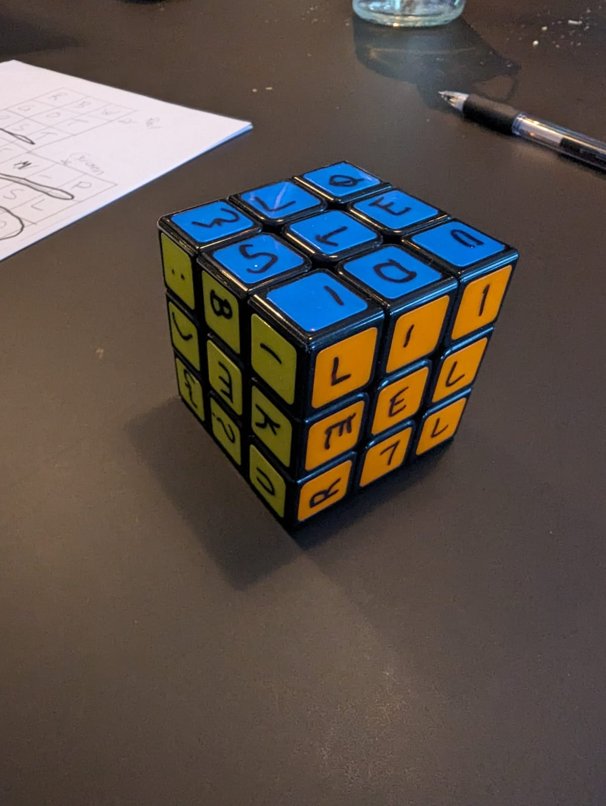
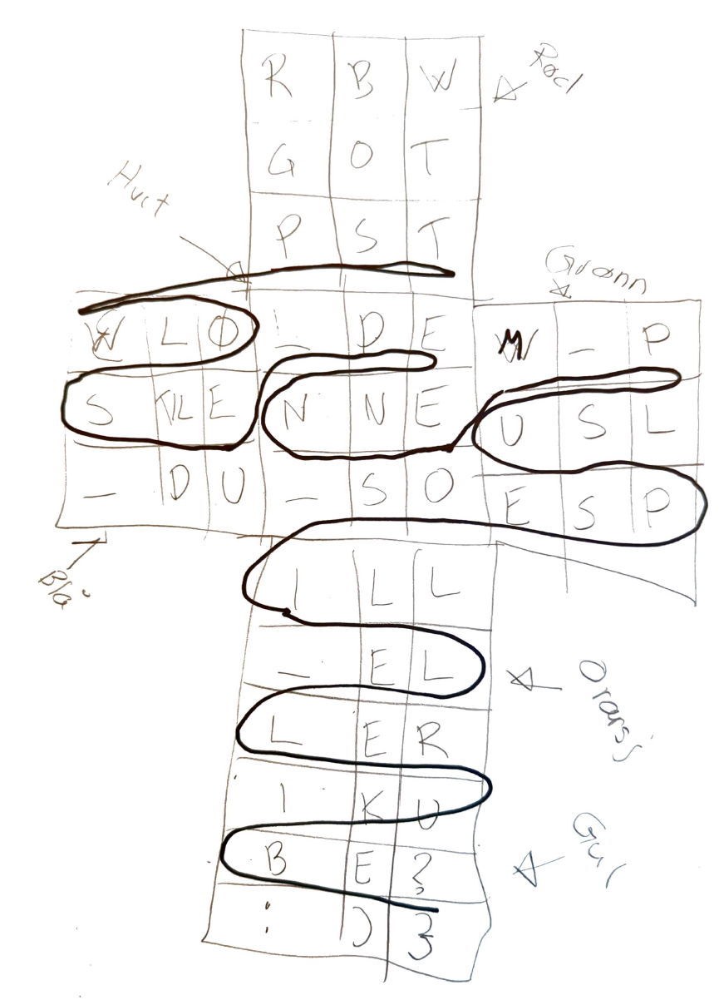

# Scrambled CTF Challenge Solution

## Overview
This README outlines the solution to the "Scrambled" challenge from a Capture The Flag (CTF) competition, which involved deciphering a message encoded in a Rubik's Cube formation.

## Challenge Description
- **Name:** Scrambled
- **Brief:** Significant challenges occurred overnight with one of the machines in the workshop, producing a series of erroneous toys. The task involves uncovering what happened.
- **Issued by:** Mellomleder

## Tools Used
- [Rubik's Cube Solver](https://rubiks-cube-solver.com/)
- Personal Rubik's Cube
- Sheet of paper

## Solution Process
1. **Initial Setup:** The challenge presented an image of a Rubik's Cube laid out flat in a cross formation, with letters or symbols on each block.

2. **Cube Configuration:**
   - Utilized the Rubik's Cube Solver to find the solution for the cube's layout.
   - Manually adjusted my Rubik's Cube to match the challenge's configuration.

3. **Transcription and Analysis:**
   - Labeled each block on my Rubik's Cube with corresponding letters.
   - Solved the cube following the solver's steps.
   - Laid out the solved cube in a cross formation and transcribed the pattern.

4. **Flag Discovery:**
   - Analyzed the pattern and traced lines across the formation to reveal the hidden flag.

## Discovered Flag
- `PST{LØSTE_DU_DENNE_SOM_PUSLESPILL_ELLER_KUBE?:)}`

## Conclusion
This approach demonstrates a methodical process of solving a physical puzzle and translating it into a digital format to uncover a hidden message.

