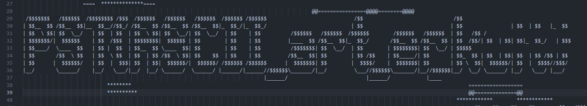

# ASCII Art Decryption Challenge - CTF NPST 2023

## Task Description

In this Capture The Flag (CTF) challenge, we were provided with a Python script named `pinneved.py` and a corresponding encrypted file `pinneved.txt`. The task involved decrypting the content of this file to reveal hidden ASCII art, which contained the key to solving the challenge.

### Provided Files

1. `pinneved.py`: A Python script containing the encryption logic.
2. `pinneved.txt`: The encrypted content needing decryption.

## Solution Overview

The solution involved writing a decryption script, `pinneved-decrypt.py`, to reverse the encryption process applied in `pinneved.py`. The decrypted content revealed ASCII art pieces which, when assembled correctly, formed the solution to the challenge.

### Decryption Process

The `pinneved.py` script performed the following operations on the input data:

- Split the input into 24 fragments.
- Each fragment underwent a character shift (ASCII value +2).
- Fragments were reordered according to a predefined sequence (`otp` list).

To decrypt the content, the following steps were taken in reverse order:

1. **Reading Encrypted Data**: The encrypted content from `pinneved.txt` was read into the script.

2. **Fragmentation and Reordering**: The content was split into 24 fragments, and each fragment was reordered based on the `otp` list.

3. **Character Shift Reversal**: Each character in the fragments was shifted back by -2 in their ASCII value.

4. **Reconstruction**: The modified fragments were concatenated to form the complete decrypted ASCII art.

### ASCII Art Analysis

After successfully running the `pinneved-decrypt.py` script, the output was a series of ASCII art images. These images, when viewed in the correct orientation and order, revealed the hidden message: `PST{ASCII_art_er_kult}`.

### ASCII Art Visualization

Below is the final ASCII art output visualized in `fasit.png`, showing the decrypted message:



## Conclusion

This challenge demonstrated the importance of understanding encryption and decryption processes, pattern recognition in ASCII art, and the necessity of meticulous attention to detail in CTF challenges.

---

## Files

- `pinneved.py`: Original encryption script.
- `pinneved.txt`: Encrypted content file.
- `pinneved-decrypt.py`: Script used for decryption.
- `slede_decrypted.txt`: Decrypted ASCII art output.

---

## Usage

To replicate the decryption process:

```bash
python pinneved-decrypt.py
```
