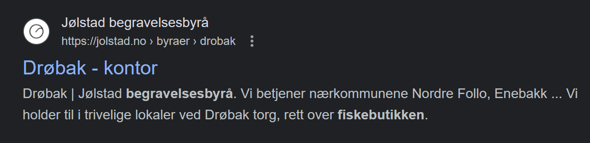

# Muldvarpjakt

## Task Overview

In the "Muldvarpjakt" task, we were presented with an intelligence-gathering challenge. The mission was to locate a meeting point in Mainland Norway between a suspected source leader working for South Pole services and an unknown entity believed to be a mole. The goal was to enable our surveillance elves to observe the meeting and identify the unknown object.

## Mission Brief

We received a message detailing the meeting place:

> "Take the bus and get off at the stop right by the funeral home next to a seafood shop. I will be ready by the fountain a few dozen meters from the bus stop. Once you have reached the fountain, we will walk together to the nearby library, which is less than 50 meters from the fountain, and complete the transfer."

Our task was to deduce the meeting location from this message. The response format was specified as `PST{BERGEN LUFTHAVN}`.

## Investigation Process

### Initial Reconnaissance

- Initially, extensive reconnaissance was conducted in Bergen, based on the assumption that the meeting would take place in a significant urban area.
- Despite thorough efforts, the correct location was not identified in Bergen.

### Breakthrough via Online Search

- A pivot in strategy involved utilizing Google search to gather more information.
- This led to the discovery of a town named Drøbak, which seemed to align with the details provided in the message.

### Pinpointing the Exact Location

- Using Google Maps and following the descriptions in the task, a systematic search of Drøbak was undertaken.
- Key landmarks such as the funeral home, seafood shop, fountain, and library were identified in relation to each other.

### Solution

The precise location of the meeting was determined to be `Frogn Bibliotek` in Drøbak. The final answer formulated was `PST{FROGN BIBLIOTEK}`.

## Conclusion

The task was successfully completed by combining initial on-the-ground reconnaissance with digital investigation tools. The use of Google Maps proved crucial in correlating real-world locations with the details provided in the message.

---

**Note**: This README is a summary of the steps taken to solve the "Muldvarpjakt" task for educational and training purposes.
