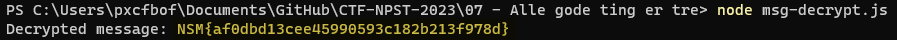

# RSA Decryption Challenge: "Alle gode ting er tre"

## Task Description

**Challenge Issued By**: Mellomleder

**Task**: 
Alveresepsjonen discovered a mysterious note in the mailbox of Nissen's workshop early today. Usually, this is something that Ronny, Shahana, and Ada from the elf department of cryptography would handle. Unfortunately, all three are away at an important conference in San Francisco, learning about the latest developments in exponents and modular arithmetic. Can you step in for them and figure out what this message really is?

## Solution

To solve this challenge, a JavaScript script (`msg-decrypt.js`) was written and executed using Node.js. The script reads RSA encryption parameters from a `msg.txt` file and decrypts the encoded message.

### Environment Setup

1. **Install Node.js**: Ensure that Node.js is installed on your system. You can download it from [Node.js official website](https://nodejs.org/).

2. **Install `big-integer` Library**: The `big-integer` library is required to handle large numbers in the script. Install it using npm:

3. **Create Script and Text Files**: 
- Place the `msg-decrypt.js` script in a directory.
- Ensure the `msg.txt` file with the RSA parameters is in the same directory.

### msg.txt Content

The `msg.txt` file contains the RSA parameters:<br>
```dotnetcli
N=0x5993c05eac819aa17ae7e4e4b9f75b2d6fdbaec913e0b2d6f4ba585a991b62279ed9ac53aeadee3327321e02c0c06ecda184952df5d1cc8b3024643c0afdd9bbd52bf2d830f54d6e59e76844394eb0ffc498995dd270b9b95bf1614984472a3ef12d8c1bad64529be7b638c5d0fccf61c5ac2ab4564e5215748eb2533d4d949afd9486426dbf0c06a07c2c0f6d482e4f8cf3052e6ab9df20878b747936d590c3b8bb0219a378cbec03baee4ea8d0641c57bcc18706bbe92c3f2d7569c424062d9b79464958419b4000e3e31c077bba27ef2fc6ed15b7ebdcdb41d1cbf7708737e200904015d341ef94c537a916f1fec61e0b1bf64762e5a97bafdde290b939c3<br>
e=3<br>
C=0x755040806d1d699c76cf2b3fffc28ad8831a8667e1b064297a43733b89f6272483a5a728b725d02b069f8fc65eb51d89ce9133df8f5f2d5e13f63c5423021eb2b56eeb91b11d78717528dfce169450a08d40f5ab451c8ac1f8c6875cffbd4d70259d436ed70baeae37b9bdafc5965
```


### msg-decrypt.js

The script used for decryption is as follows:

```javascript
const fs = require('fs');
const bigInt = require("big-integer");

function cubeRoot(value) {
    let low = bigInt(0), high = value;
    while (low.lesser(high)) {
        let mid = low.add(high).divide(2);
        if (mid.pow(3).lesser(value)) {
            low = mid.add(1);
        } else {
            high = mid;
        }
    }
    return low;
}

function hexToText(hexString) {
    let hex = hexString.toString(16);
    let str = '';
    for (let i = 0; i < hex.length; i += 2) {
        str += String.fromCharCode(parseInt(hex.substr(i, 2), 16));
    }
    return str;
}

// Read RSA parameters from msg.txt
fs.readFile('msg.txt', 'utf8', (err, data) => {
    if (err) {
        console.error("Error reading the file:", err);
        return;
    }

    // Extract parameters from the file content
    const params = {};
    data.split('\n').forEach(line => {
        const [key, value] = line.split('=').map(part => part.trim());
        if (key && value) {
            // Remove the '0x' prefix if present and parse as big integer
            params[key] = bigInt(value.replace(/^0x/, ''), 16);
        }
    });

    // Extract N, e, and C
    const { N, e, C } = params;

    // Decrypting the message
    try {
        const root = cubeRoot(C);
        const decryptedMessage = hexToText(root);
        console.log("Decrypted message:", decryptedMessage);
    } catch (error) {
        console.log("An error occurred during decryption:", error);
    }
});
```

## Execution and Output

The script was executed using the command:

```bash
node msg-decrypt.js
```

This resulted in the successful decryption of the message. The output in the console was:

