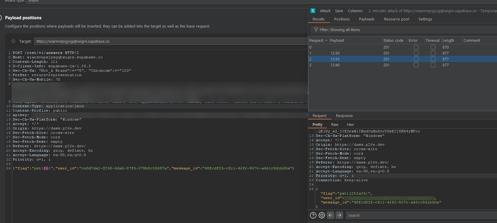

# Kronolokalisering

## Task Description

In this task, we received a piece of evidence: a paper with a message on one side stating, “Oppmøtested for den topphemmelige sydpolinfiltrasjonen 2023, rekognosering 23. november” (Translation: "Meeting place for the top-secret South Pole infiltration 2023, reconnaissance November 23"). On the other side of the paper, there was a picture. The objective was to determine the exact time the picture was taken in order to retrieve surveillance images and identify who planned the event.

We were instructed to send our response in the format of `KRIPOS{time}`, e.g., `KRIPOS{23:35}`, rounded to the nearest five minutes.

## Process

### Identifying the Location

- The task began with an attached picture named `bilde.jpeg`, which displayed a location.
- To identify this location, the image was uploaded to Google’s reverse image search.
- The search results indicated that the picture was of the Europol building in The Hague, Netherlands.

The picture that was provided: 

### Determining the Time

- The next step was to ascertain the time of day when the picture was taken.
- For this, Burp Suite's Intruder tool was utilized.
- A payload of all possible times during a 24-hour period, starting from `00:00` and progressing in 5-minute intervals, was prepared.
- These times were systematically sent in requests to determine the correct time.
- The solution was identified as `13:20`.

Screenshot example from Burp Suite: 

### Conclusion

The precise time that the picture was taken was successfully determined using a combination of image search and automated request testing with Burp Suite. This information was vital in furthering the investigation for the Kronolokalisering task.

---

**Note**: This document is a summary of the steps taken to solve a specific task in a controlled and ethical environment.
