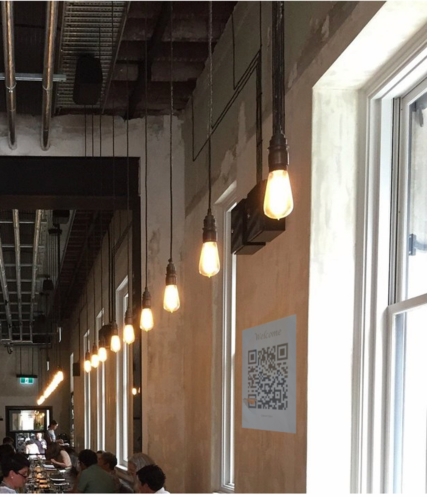

# GeoGjettr

## Task Overview

The "GeoGjettr" task involved a location identification challenge as part of a GeoGuessr competition. The task was to determine the city from a provided image featuring a restaurant and a QR code on its wall.

## Challenge Brief

The task was to quickly identify the city depicted in the photograph. The response format was specified as `KRIPOS{city name}`.

## Process and Solution

### Analyzing the Clue

- The initial step involved closely examining the provided image.
- A QR code on the wall of the restaurant in the image was a prominent feature.

### QR Code Decryption

- The QR code was scanned to reveal a clue. It displayed the text "State building."
- This clue indicated that the name or the theme of the restaurant was likely related to a state building.

### Online Search

- A Google search was conducted using the keywords "State building restaurant."
- This search led to the discovery of a restaurant named "Petition" located in Perth, which showed striking similarities to the one in the image.

### Formulating the Answer

- Based on the evidence gathered, it was concluded that the restaurant was indeed the "Petition" in Perth.
- The final answer was submitted as `KRIPOS{PERTH}`.

### Confirmation

- The response `KRIPOS{PERTH}` was found to be correct, successfully completing the task.

Initial Picture: 

## Conclusion

The "GeoGjettr" task was solved effectively through a combination of image analysis, QR code scanning, and strategic online research. The key to success was identifying and leveraging the unique QR code clue within the image.

---

**Note**: This README documents the approach and steps taken to solve the "GeoGjettr" task as part of a GeoGuessr competition for educational purposes.
